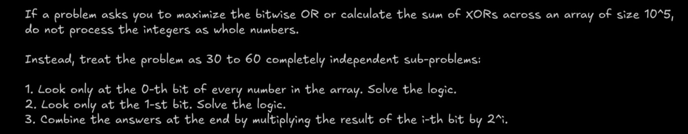

## Basics of Bit Manipulation

* Signed numbers are stored in 2's complement format. Total numbers represented are half in terms of possitive but the range is preserved.
    - Signed -(2^n-1) <-> (2^n-1) - 1
    - unsidged 0 <-> (2^n-1)

### Bitwise Operators
#### AND 
* logical multiplication at bit level (x * y)

#### OR
* logical addition at the bit level (x + y)

#### Ex-OR (Exclusive OR)
* It is the difference detector
* IT is the addition of numbers without carry. (ignoring carry)

#### NOT 
* Flips all the bits

#### Left Shift <<
* a << k = a * 2^k

#### Right Shift >>
* a >> k = a / 2^k

### Masks
* Checking if ith number is set for number x: (x & (1 << i)) != 0
* Setting ith Bit for number x: x = (x | (1 << i))
* clearing the ith bit for number x: x = x & ~(1 << i)
* Toggling the ith bit for number x: x = x ^ (1 << i)
* Isolating the lowest set bit for number x: x = x & (~x + 1) (x & -x) gives the mask to operate on lowest set bit

### Checking if a number is power of 2
* (x & x -1) == 0 8 = 1000 & 0111 if one then and only then yes
* odd : x&1 else even except 0

### Counting Set Bits
* Popcount

### Bitsets

### Bitmasking & Combinatorics
1 -> Include the value
0 -> Exclude the value

* Subset generation using bitmasks

### Set Theory in Bitwise
* Set properties 

## Submask Ennumeration
* 

### Bit independence
* bits never interact with their neighbours
* 

### XOR Algebra
* x ^ x = 0 (ofcourse there is no difference in both numbers)
* x ^ 0 = x
* Commutative and associative properties hold true
* if a ^ b = c then a ^ c = b and c ^ b = a

### Fundamental Equation
* a + b = (a ^b) + 2(a & b)
    - (a ^ b) is addition witohut carries
    - (a & b) tells where carry occurs
    - because a carry shifts bit by 1 we multiply by 2^1

* a + b = (a & b) + (a | b) is also a valid identity

### Prefix XOR Querries

* Same as prefix sums cancels out because x ^ x = 0

### MSB Greedy Property
* Maximizing a number ? build answer greedily from MSB to LSB
* 
